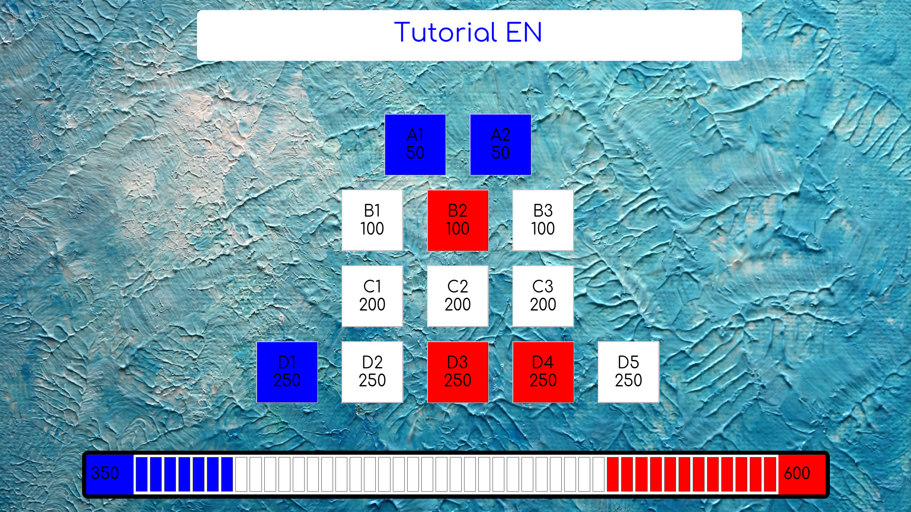
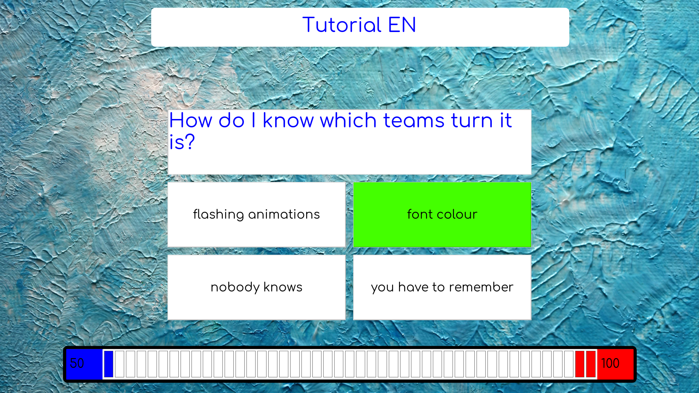

# Quizwall
A simple quiz game for two teams made with tkinter and python.


Features:
- Create your own quiz game with your questions
- Use audio, images or videos to show the solution

## The Rules
The teams alternately choose a question. The team that choose the question first gets the chance to answer. If they answer the question correct they get the points, if not the other team can answer to get the points. The teams alternately take a guess until the question is answered. After all questions are answered, the team with the most points wins.

## Getting started
If you have python installed you can just go ahead install the [```requirements```](requirements.txt) and start the [```quiz_wall.py```](quiz_wall.py) file.

On Windows you can run the [```quiz_wall.exe```](quiz_wall.exe) file.

The first screen will present you with all available quiz games. You can choose which quiz to play there. In addition you can set the resolution for the quiz at the bottom. But in most cases the auto detection should be fine.


After the quiz selection the quiz wall is loaded and the first team can start by choosing a question.

## Create a new quiz
The [```English```](Tutorial\EN.csv) and [```German```](Tutorial\DN.csv) tutorials can be used to get familiar with the gameplay and the features. Use them as a start point for your own quiz.

In general a quiz is a spreadsheet saved as an  ```.csv``` file that contains the questions, answers, points and an optional solution file.

## Credits
This project uses:
|Project|Link|Used for|
|----|----|-----------|
|vlc|videolan.org|Audio and video playback|
|freesound|freesound.org|Gameplay sounds|
|bilder4ever|bilder4ever.eu|Background image|
